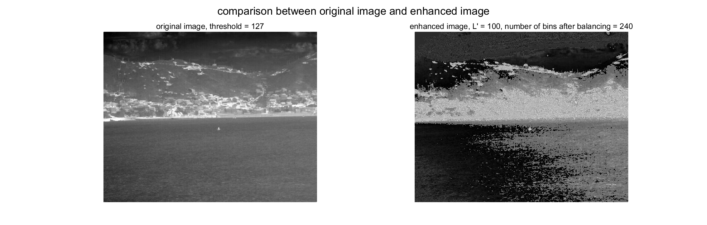

# Infrared Image Enhancement

This repository contains MATLAB code for a traditional method to enhance infrared images using histogram equalization and gray level compression and stretching techniques. The main script loads an image, processes it, and displays the results.

## Result in Visualization



## Prerequisites

- MATLAB installed on your system.
- Image Processing Toolbox for MATLAB.


### Configurations

- `l_prime`: The target level for compression and stretching.
- `n_bins_hisequ`: The number of bins for histogram equalization.
- `image_path`: The path to the input image.

Example:

    ```matlab
    l_prime = 100;
    n_bins_hisequ = 240;
    image_path = './imgs/small_3.jpg';
    ```


## Functions

### Main Script
- `main.m`: Loads the image, ensures it is in grayscale, enhances the image, and displays the results.

### Helper Functions
- `compress_and_stretch(image, bg_levels, target_levels, L_prime)`: Compresses and stretches gray levels of the image.
- `display_images_with_parameters(original_image, enhanced_image, L_prime, threshold, n_bins_hisequ)`: Displays the original and enhanced images with parameters.
- `enhance_infrared_image(input_image, l_prime, n_bins_hisequ)`: Enhances the infrared image using histogram equalization and Otsu's thresholding method.
- `ensure_gray_image(image)`: Ensures the input image is in grayscale.
- `find_threshold(image)`: Finds the optimal threshold using Otsu's method.
- `sort_gray_levels(bg_mask, target_mask, image)`: Sorts gray levels based on their frequencies in the background and target regions.

## License

This project is licensed under the MIT License - see the [LICENSE](LICENSE) file for details.
